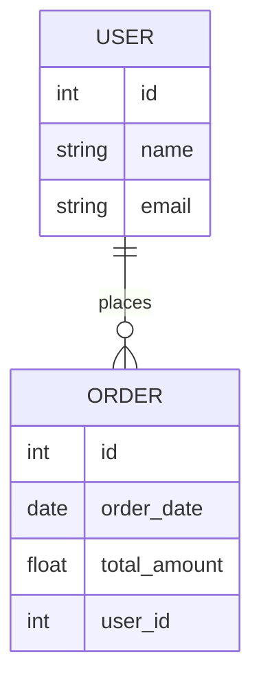

# ERD-viewer

This is a simple web application built using **HTML, CSS, and JavaScript**.

## Features
- Responsive design
- Interactive UI components
- Client-side form validation
- Local storage support

## Installation
1. Clone the repository:
   ```sh
   git clone [https://github.com/adilaslam1807/ERD-viewer
   ```
2. Navigate to the project directory:
   ```sh
   cd ERD-viewer
   ```
3. Open `index.html` in your browser.

## Technologies Used
- **HTML5** - Structure of the web pages
- **CSS3** - Styling and layout
- **JavaScript** - Client-side scripting

## File Structure
```
📂 ERD-viewer
 ├── 📄 index.html
 ├── 📂 css
 │   ├── style.css
 ├── 📂 js
 │   ├── script.js
 ├── 📂 assets
 │   ├── images/
 └── 📄 README.md
```

## Entity-Relationship Diagram (ERD)
Below is a sample **ERD** for a simple user and orders system:



## Contributing
Feel free to fork the repo and submit a pull request!

## License
This project is licensed under the MIT License - see the LICENSE file for details.
